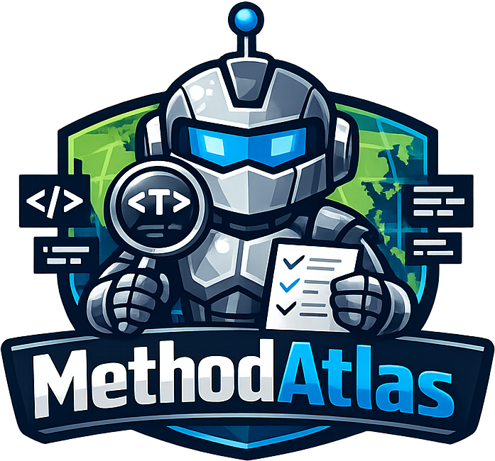

# MethodAtlas



MethodAtlas is a CLI tool that scans Java source trees for JUnit test methods and emits one structured record per discovered method — with optional AI-assisted security classification.

It is built for teams that must demonstrate test coverage of security properties to auditors, regulators, or security review boards: it separates **deterministic source analysis** from **optional AI interpretation** so that every result is traceable, repeatable, and defensible.

## Why MethodAtlas

Security-focused teams in regulated industries need more than a passing test suite. They need to demonstrate *which* tests cover *which* security controls, at a level of detail that satisfies external review.

MethodAtlas addresses this by turning an existing JUnit 5 test suite into a structured inventory with minimal setup:

| Challenge | What MethodAtlas provides |
| --- | --- |
| "Show us your security test coverage" | AI-classified inventory with rationale per method |
| "Prove the tests haven't changed since last audit" | Per-class SHA-256 content fingerprints (`-content-hash`) |
| "Integrate this into our SAST pipeline" | Native **SARIF 2.1.0** output, compatible with GitHub Advanced Security, VS Code, Azure DevOps, and SonarQube |
| "We can't send source code to external AI APIs" | Local inference via **Ollama**, or a two-phase **manual AI workflow** for air-gapped environments |
| "Classification must be consistent and auditable" | Closed, versioned **security taxonomy** with optional custom taxonomy aligned to your controls framework |
| "We need confidence scores, not just yes/no" | Per-method AI **confidence scores** (`0.0–1.0`) for threshold-based filtering and human-review queues |
| "Annotate the source files for us" | **Apply-tags mode** writes `@DisplayName` and `@Tag` annotations directly into source files |
| "Our @Tag annotations look stale" | **Tag vs AI drift detection** flags disagreements between source annotations and AI classification |

## Key capabilities

- **Deterministic test discovery** — JavaParser AST analysis; no inference, no false positives on method existence
- **SARIF 2.1.0 output** — first-class integration with static analysis platforms and IDE tooling
- **AI security classification** — classifies each test method against a closed security taxonomy; supports Ollama, OpenAI, Anthropic, Azure OpenAI, Groq, xAI, GitHub Models, Mistral, and OpenRouter
- **Confidence scoring** — per-method decimal score (`-ai-confidence`); filter by threshold for audit packages
- **Content hash fingerprints** — SHA-256 of the class AST text (`-content-hash`); all methods in the same class share the same hash; enables incremental scanning and change detection
- **Tag vs AI drift detection** — `-drift-detect` flags methods where `@Tag("security")` in source disagrees with the AI classification
- **GitHub Actions annotations** — `-github-annotations` emits inline PR annotations for security-relevant methods without requiring a GitHub Advanced Security licence
- **Apply-tags** — writes AI-suggested `@DisplayName` and `@Tag` annotations back into source files; idempotent
- **Manual AI workflow** — two-phase prepare/consume workflow for environments where API access is blocked
- **Local inference** — Ollama support keeps source code entirely within your network
- **YAML configuration** — share scan settings across a team or CI pipeline without repeating CLI flags
- **Custom taxonomy** — supply an external taxonomy file aligned to ISO 27001, NIST SP 800-53, PCI DSS, or your own controls framework
- **Multiple output modes** — CSV (default), plain text, SARIF, and GitHub Actions annotations

## Quick start

Build and unpack the distribution archive, then:

```bash
cd methodatlas-<version>/bin

# Static scan — outputs fqcn, method, loc, tags
./methodatlas /path/to/project

# AI security classification (local Ollama)
./methodatlas -ai /path/to/project

# SARIF output — pipe to a file for upload to GitHub Advanced Security
./methodatlas -sarif /path/to/project > results.sarif

# SARIF + AI enrichment + content hash fingerprints
./methodatlas -ai -sarif -content-hash /path/to/project > results.sarif

# Apply AI-suggested annotations back into source files
./methodatlas -ai -apply-tags /path/to/tests

# GitHub Actions inline PR annotations
./methodatlas -ai -github-annotations /path/to/tests
```

See [docs/cli-reference.md](docs/cli-reference.md) for the complete option reference.

## What MethodAtlas reports

For each discovered JUnit test method, MethodAtlas emits one record.

**Source-derived fields** (always present, no AI required):

| Field | Description |
| --- | --- |
| `fqcn` | Fully qualified class name |
| `method` | Test method name |
| `loc` | Inclusive line count of the method declaration |
| `tags` | Existing JUnit `@Tag` values declared on the method |
| `content_hash` | SHA-256 fingerprint of the enclosing class (opt-in via `-content-hash`) |

**AI enrichment fields** (present when `-ai` is enabled):

| Field | Description |
| --- | --- |
| `ai_security_relevant` | Whether the model classified the test as security-relevant |
| `ai_display_name` | Suggested security-oriented `@DisplayName` value |
| `ai_tags` | Suggested security taxonomy tags (e.g. `security;auth`, `security;crypto`) |
| `ai_reason` | Short rationale for the classification |
| `ai_confidence` | Model confidence score `0.0–1.0` (opt-in via `-ai-confidence`) |
| `tag_ai_drift` | Disagreement between source `@Tag("security")` and AI classification (opt-in via `-drift-detect`) |

## Output modes

### CSV (default)

```csv
fqcn,method,loc,tags,ai_security_relevant,ai_display_name,ai_tags,ai_reason
com.acme.auth.LoginTest,testLoginWithValidCredentials,12,,true,SECURITY: auth - validates session token,security;auth,Verifies session token is issued on successful login.
com.acme.util.DateTest,format_returnsIso8601,5,,false,,,Tests date formatting only.
```

### SARIF 2.1.0

```bash
./methodatlas -ai -sarif /path/to/tests > results.sarif
```

Produces a single valid [SARIF 2.1.0](https://docs.oasis-open.org/sarif/sarif/v2.1.0/sarif-v2.1.0.html) JSON document. Security-relevant methods receive SARIF level `note`; all other test methods receive level `none`. Rule IDs are derived from AI taxonomy tags (`security/auth`, `security/crypto`, etc.).

SARIF is natively consumed by:
- **GitHub Advanced Security** — upload via the `upload-sarif` action to surface findings in the Security tab
- **VS Code** — [SARIF Viewer extension](https://marketplace.visualstudio.com/items?itemName=MS-SarifVSCode.sarif-viewer) renders results inline
- **Azure DevOps** — SARIF viewer pipeline extension
- **SonarQube** — import via the generic issue import format after conversion

### Plain text

```bash
./methodatlas -plain /path/to/project
```

Human-readable line-oriented output, useful for terminal inspection and shell scripting.

### GitHub Actions annotations

```bash
./methodatlas -ai -github-annotations /path/to/tests
```

Emits `::notice` / `::warning` workflow commands that GitHub Actions renders as inline annotations on the PR diff. Does not require a GitHub Advanced Security licence.

See [docs/output-formats.md](docs/output-formats.md) for full format descriptions and examples.

## SARIF for regulated environments

SARIF is the OASIS standard interchange format for static analysis results. Adopting it means that MethodAtlas findings can be imported into any SARIF-compatible platform without custom tooling, and the format itself provides a stable, auditable record.

A SARIF result from MethodAtlas includes:
- **Physical location** — source file path relative to `%SRCROOT%` and the method's start line
- **Logical location** — fully qualified method name (`com.acme.auth.LoginTest.testLoginWithValidCredentials`) with kind `member`
- **Properties bag** — `loc`, optional `contentHash`, and all AI enrichment fields including `tagAiDrift`

This makes each SARIF finding independently traceable to a specific method in a specific class at a specific revision.

## AI security classification

When `-ai` is enabled, MethodAtlas submits each parsed test class to a configured AI provider for security classification. The model receives:

1. The **closed security taxonomy** — a controlled set of tags that constrains what the model can return
2. The **exact list of JUnit methods** discovered by the parser — the model cannot invent or skip methods
3. The **full class source** as context for semantic interpretation

Because discovery is AST-based and AI classification is constrained by a fixed tag set, the structural inventory is deterministic even when the semantic interpretation uses a language model.

### Supported providers

| Provider value | AI product / platform | Deployment | Free tier |
| --- | --- | --- | --- |
| `ollama` | Any locally installed model | Local — source never leaves the machine | — |
| `auto` | Ollama → API key fallback | Local first, cloud fallback | — |
| `openai` | ChatGPT / OpenAI API | Cloud | No |
| `anthropic` | Claude / Anthropic API | Cloud | No |
| `xai` | Grok / xAI API | Cloud | Limited |
| `groq` | Groq (fast LPU inference) | Cloud | Yes |
| `github_models` | GitHub Models | Cloud | Yes (GitHub account) |
| `mistral` | Mistral AI | Cloud (EU) | Limited |
| `openrouter` | Many models via OpenRouter | Cloud | Yes (free models) |
| `azure_openai` | Azure OpenAI Service | Customer's Azure tenant | No |

See [docs/ai/providers.md](docs/ai/providers.md) for per-provider setup instructions, including which well-known AI assistant corresponds to which provider value.

### Confidence scoring

Pass `-ai-confidence` to add a `0.0–1.0` confidence score per method:

```bash
./methodatlas -ai -ai-confidence /path/to/tests | \
  awk -F',' 'NR==1 || ($9+0) >= 0.7'   # keep only high-confidence findings
```

| Score | Meaning |
| --- | --- |
| `1.0` | Explicitly and unambiguously tests a named security property |
| `~0.7` | Clearly tests a security-adjacent concern |
| `~0.5` | Plausible but ambiguous; candidate for manual review |
| `0.0` | Not security-relevant |

See [docs/ai-guide.md](docs/ai-guide.md) for the full interpretation guide.

## Content hash fingerprints

Pass `-content-hash` to append a SHA-256 fingerprint of each class to every emitted record:

```bash
./methodatlas -content-hash -sarif /path/to/tests > results.sarif
```

The hash is computed from the JavaParser AST text of the enclosing class. All methods in the same class share the same value, and the hash changes only when the class body changes — not when unrelated files are modified.

Practical applications:
- **Incremental scanning** — skip classes whose hash has not changed since the last run
- **Audit traceability** — correlate a SARIF finding back to the exact class revision that produced it
- **CI change detection** — detect modified test classes between two pipeline stages without diffing source files

## Manual AI workflow

For environments where direct AI API access is blocked by corporate policy, MethodAtlas supports a two-phase manual workflow:

```bash
# Phase 1 — write prompts to files
./methodatlas -manual-prepare ./work ./responses /path/to/tests

# (paste each work file's AI prompt into a chat window, save the response)

# Phase 2 — consume responses and emit the enriched CSV (or apply tags)
./methodatlas -manual-consume ./work ./responses /path/to/tests
./methodatlas -manual-consume ./work ./responses -apply-tags /path/to/tests
```

All taxonomy and confidence flags apply equally in manual mode. The consume phase is incremental — you can process classes as responses arrive rather than waiting for the full batch.

See [docs/ai-guide.md](docs/ai-guide.md#manual-ai-workflow) for the complete workflow.

## YAML configuration

Store shared settings in a YAML file so that CI pipelines and team members use consistent options without repeating flags:

```yaml
outputMode: sarif
contentHash: true
ai:
  enabled: true
  provider: ollama
  model: qwen2.5-coder:7b
  confidence: true
  taxonomyMode: optimized
```

```bash
./methodatlas -config ./methodatlas.yaml /path/to/tests
```

Command-line flags always override YAML values. See [docs/cli-reference.md](docs/cli-reference.md#-config-file) for the complete field reference.

## Distribution layout

```text
methodatlas-<version>/
├── bin/
│   ├── methodatlas
│   └── methodatlas.bat
└── lib/
    ├── methodatlas-<version>.jar
    └── *.jar  (runtime dependency libraries)
```

The startup scripts in `bin/` configure the classpath automatically to include all JARs in `lib/`, so no manual setup is required after extraction.

## Documentation

| Document | Contents |
| --- | --- |
| [docs/cli-reference.md](docs/cli-reference.md) | Complete option reference, YAML schema, and example commands |
| [docs/output-formats.md](docs/output-formats.md) | CSV, plain text, SARIF, and GitHub Annotations format descriptions |
| [docs/ai-guide.md](docs/ai-guide.md) | AI providers, confidence scoring, taxonomy, apply-tags workflow, manual workflow |
| [docs/ai/providers.md](docs/ai/providers.md) | Per-provider setup: Ollama, OpenAI, Anthropic, Azure OpenAI, Groq, xAI, GitHub Models, Mistral, OpenRouter |
| [docs/ai/drift-detection.md](docs/ai/drift-detection.md) | Tag vs AI drift detection: detecting stale `@Tag("security")` annotations |
