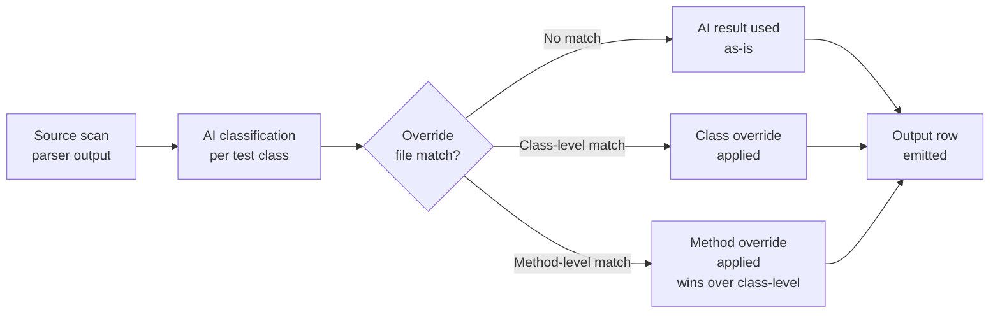

# Classification overrides

The override file is a YAML document that records human-reviewed corrections to AI classifications. Overrides are applied after AI classification on every run, so decisions persist across re-runs without touching source code.

## When to use

| Scenario                                                             | Override action                                               |
|----------------------------------------------------------------------|---------------------------------------------------------------|
| AI marked a utility method as security-relevant                      | Set `securityRelevant: false`                                 |
| AI missed a security-critical test                                   | Set `securityRelevant: true` with `tags` and `reason`         |
| AI assigned wrong taxonomy tags                                      | Supply corrected `tags` list                                  |
| Running in static mode but need to mark known-good tests             | Add override entries; no AI required                          |
| Audit trail requires human-authored rationales                       | Add `reason` and `note` fields                                |

## Override evaluation order

Every output row passes through this pipeline:



Overrides never modify source code. They are applied in memory at output time on every run.

## Confidence behaviour

When any override field is applied to a method, the output confidence value is set automatically:

- `securityRelevant: true` → confidence `1.0`
- `securityRelevant: false` → confidence `0.0`

This reflects the fact that a human review provides higher certainty than any AI score. The override confidence always replaces the AI confidence entirely — a method overridden to `securityRelevant: true` always appears with confidence `1.0` regardless of what the AI scored.

## File format

The file is a YAML document with a top-level `overrides` list. Each entry targets either a single method or every method in a class. The example below shows every available field:

```yaml
overrides:

  # Correct a false positive: AI classified this as security-relevant but it is not.
  - fqcn: com.acme.util.DateFormatterTest
    method: format_returnsIso8601       # targets this method only
    securityRelevant: false
    tags: []                            # explicit empty list overrides AI tags
    displayName: ""                     # optional: override AI-suggested display name
    reason: "Date formatting only — no security property tested"
    note: "Reviewed 2026-04-24 by alice"

  # Correct a false negative: AI missed this security-critical test.
  - fqcn: com.acme.crypto.AesGcmTest
    method: roundTrip_encryptDecrypt
    securityRelevant: true
    tags: [security, crypto]
    displayName: "SECURITY: crypto — AES-GCM round-trip"
    reason: "Verifies ciphertext integrity under AES-GCM — critical crypto test"
    note: "Confirmed by security team 2026-04-20"

  # Apply the same override to all methods in a class (no 'method' field).
  - fqcn: com.acme.auth.Oauth2FlowTest
    securityRelevant: true
    tags: [security, auth]
    reason: "Entire class covers OAuth 2.0 flow — AI taxonomy too narrow"
    note: "Entire class override; individual methods may be further overridden"
```

## Field reference

| Field              | Required | Type             | Meaning                                                                                                    |
|--------------------|----------|------------------|------------------------------------------------------------------------------------------------------------|
| `fqcn`             | **Yes**  | string           | Fully qualified class name; must match the `fqcn` column in MethodAtlas output                             |
| `method`           | No       | string           | Method name; when absent the override applies to **all** methods in the class                              |
| `securityRelevant` | No       | boolean          | `true` or `false`; when absent the AI decision (or default `false`) is kept                                |
| `tags`             | No       | list of strings  | Security taxonomy tags; when absent the AI tags (or empty list) are kept                                   |
| `displayName`      | No       | string           | Suggested `@DisplayName` value; when absent the AI-suggested name (or `null`) is kept                      |
| `reason`           | No       | string           | Human-readable rationale for the classification; when absent the AI rationale is kept                      |
| `note`             | No       | string           | Free-text annotation for human use only; **never appears in any MethodAtlas output format**                |

Only fields you specify are overridden. Unspecified fields retain their AI-derived or default values. You can correct just the security-relevance flag of a method while keeping the AI-assigned tags and rationale.

## Precedence rules

When both a class-level entry (no `method` field) and a method-level entry exist for the same class, the **method-level entry wins** for the targeted method. All other methods in the class receive the class-level override.

If multiple class-level entries target the same `fqcn`, the last one in file order wins.

## Static mode (no AI)

Overrides work even when AI is disabled. If an override marks a method as `securityRelevant: true`, MethodAtlas synthesizes a full AI-style result from the override fields alone. This makes it possible to produce an enriched CSV or SARIF report purely from human-authored classifications with no network access:

```bash
./methodatlas -override-file ./overrides.yaml src/test/java
```

Methods not targeted by any override in static mode will have `securityRelevant=false` and empty tag/reason fields.

## Connecting the override file

### Command line

```bash
./methodatlas -ai -override-file ./team-overrides.yaml src/test/java
```

### YAML configuration file

```yaml
overrideFile: ./team-overrides.yaml

ai:
  enabled: true
  provider: anthropic
  model: claude-sonnet-4-5
```

A command-line `-override-file` flag always takes precedence over the YAML value.

## Workflow integration

### Reusable workflow (MethodAtlas self-analysis / GitHub Models)

The bundled reusable workflow (`.github/workflows/methodatlas-analysis.yml`) supports two paths for supplying the override file.

**Simplified path — local file in the same repository**

Suitable for small teams where developers and the security reviewer share the same repository:

```yaml
# .github/workflows/pages.yml (excerpt)
jobs:
  analyze:
    uses: ./.github/workflows/methodatlas-analysis.yml
    with:
      override-file: .methodatlas-overrides.yaml
    permissions:
      contents: read
      security-events: write
      models: read
```

**Enterprise path — dedicated security team repository**

For organisations where a separate security or risk team owns classification decisions, point the workflow at the team's repository. The workflow checks it out automatically using a fine-grained PAT stored as an organisation-level secret:

```yaml
# .github/workflows/pages.yml (excerpt)
jobs:
  analyze:
    uses: ./.github/workflows/methodatlas-analysis.yml
    with:
      security-overrides-repo: acme-corp/security-overrides
      security-overrides-path: methodatlas-overrides.yaml
      security-overrides-ref: v1.3.0       # pin to a release tag
    secrets:
      SECURITY_OVERRIDES_TOKEN: ${{ secrets.SECURITY_OVERRIDES_TOKEN }}
    permissions:
      contents: read
      security-events: write
      models: read
```

In both cases the workflow passes `-override-file` to MethodAtlas only when the input is non-empty **and** the file exists on disk, so a repository that has not yet created the file runs cleanly with AI-only classifications (no error, no empty SARIF). The security-repo input takes precedence over the local-file input when both are supplied.

For a full comparison of all remote-override strategies — including HTTPS download from an artifact server and a reusable workflow owned by the security team — see [Remote Override Sources](remote-overrides.md).

### Custom CI pipeline

Store the override file in version control alongside your tests. Every CI run applies both the live AI classification and the persisted human corrections:

```yaml
# .github/workflows/security-scan.yml (excerpt)
- name: Run MethodAtlas
  run: |
    ./methodatlas -ai \
      -ai-provider anthropic \
      -ai-api-key-env ANTHROPIC_API_KEY \
      -override-file .methodatlas-overrides.yaml \
      -sarif \
      src/test/java > security-tests.sarif
```

When a PR modifies the override file, the diff is the audit trail for each human classification decision.

### Manual AI workflow

The override file integrates with the [manual AI workflow](../usage-modes/manual.md) in the same way: the operator-filled AI responses are loaded first, and overrides are applied on top.

```bash
# Consume operator responses, then apply overrides
./methodatlas -manual-consume ./work ./responses \
  -override-file .methodatlas-overrides.yaml \
  src/test/java
```

## Managing the file over time

- **After renaming or deleting a method** — the entry remains harmless; MethodAtlas silently ignores override entries for method names not found in the parsed source. You do not need to prune the file after refactoring.
- **After a class is renamed** — update the `fqcn` in the corresponding entries. Entries that no longer match any class are silently ignored.
- **Adding a `note`** — the `note` field is never emitted in any output format. Use it freely to record reviewer identity, review date, and the reason for the decision. It is the recommended way to create a tamper-evident human audit trail within the file itself.

See [CLI reference — `-override-file`](../cli-reference.md#-override-file) for the full flag description.

## Governance and review cadence

The override file is a living document that records human classification decisions. Without a defined review cadence, entries can become stale — referencing methods that were renamed, removed, or whose security relevance changed as the codebase evolved.

Recommended practices:

**Trigger-based review (minimum):** review the override file whenever:
- A class named in an override entry is renamed or moved
- A sprint introduces new test methods in a class that has class-level overrides
- A security review flags a method that is currently overridden to `securityRelevant: false`

**Time-based review (regulated environments):** review the entire file at each release candidate or at a fixed calendar interval (e.g. quarterly). The review should confirm that each entry's `note` field describes a rationale that still applies.

**Process:** store the override file in version control alongside the source. Each change to the file constitutes a PR; the PR description and approval record serve as the audit trail. In regulated environments, require a minimum of one security team reviewer on override file PRs separate from the developer who made the change.

For organisations where the override file is owned by a dedicated security team and delivered from a separate repository, see [Remote Override Sources](remote-overrides.md).
