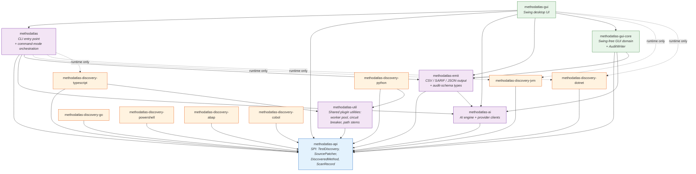

# Architecture

This document is the consolidated view of how MethodAtlas is structured.
It complements the per-feature documentation (CLI reference, output
formats, AI providers) by focusing on the module topology, the boundaries
that ArchUnit enforces at build time, and the responsibilities of each
collaborator.

## Module topology



### Module responsibilities

| Module | Responsibility |
| --- | --- |
| `methodatlas-api` | Public SPI consumed by every discovery plugin. Types: `TestDiscovery`, `SourcePatcher`, `DiscoveredMethod`, `ScanRecord`, `SourceContent`, `TestDiscoveryConfig`. No behaviour — pure contracts and data records. |
| `methodatlas-util` | Swing-free internal utilities shared by the process-worker plugins: the generic `WorkerPool` and `WorkerCircuitBreaker`, `PathStems` (dot-separated file-stem computation), and `ConfigProperties` (typed config parsing). Used by the TypeScript and Python plugins; depends only on `methodatlas-api`. |
| `methodatlas-ai` | AI suggestion engine, provider clients (Ollama, OpenAI-compatible, Anthropic, Azure OpenAI), taxonomy, prompt building, manual prepare/consume workflow, shared `HttpJsonExecutor`. |
| `methodatlas-emit` | Output emitters (CSV / plain / SARIF / JSON / GitHub annotations / delta) and audit-schema types (`DeltaReport`, `ClassificationOverride`). The schema-stability surface; downstream tooling depends on these contracts. |
| `methodatlas-discovery-*` | Eight per-language test discovery plugins. Each independently distributable. |
| `methodatlas` (root) | CLI entry point (`MethodAtlasApp`), command-mode dispatch (one class per mode), per-run identity (`ScanRun`, `ScanRunContext`), JSON-line log formatter, residual orchestration. |
| `methodatlas-gui-core` | Swing-free GUI domain types (`AppSettings`, `MethodEntry`, `AnalysisModel`, `AiProfile`) and `AuditWriter`. Hosts the audit-trail integrity surface. |
| `methodatlas-gui` | Swing desktop application (FlatLaf, RSyntaxTextArea). Thin view layer on top of `methodatlas-gui-core`. |

## Plugin seam (ArchUnit-enforced)

The optional-plugin model depends on three architectural invariants that
hold at build time, verified by ArchUnit in
`org.egothor.methodatlas.arch.ArchitectureTest`:

1. **Non-plugin code must not depend on a discovery plugin.** Plugins
   are resolved at runtime through `ServiceLoader`. A compile-time
   dependency from any non-plugin class onto a plugin class would
   defeat the optional-plugin contract and force the core to rebuild
   whenever a plugin changes.
2. **Each discovery plugin depends only on `methodatlas-api` and
   external libraries.** Imports of the orchestration core, AI
   subsystem, `emit`, or GUI types from inside a plugin are rejected.
3. **Discovery plugins do not depend on each other.** Each language
   plugin is independently distributable; a cross-plugin dependency
   would mean omitting one plugin (for example because Node.js is
   unavailable for the TypeScript scanner) could break another
   plugin's compilation or class loading.

The GUI module has its own ArchUnit boundary test in
`org.egothor.methodatlas.gui.arch.GuiBoundaryTest`:

4. **The Swing GUI must not name `AiSuggestionEngineImpl` directly.**
   GUI code constructs the engine through the
   `AiSuggestionEngine.create(...)` factory so the concrete
   implementation stays substitutable.

## Command collaborators

The CLI's command mode dispatch is composed of focused collaborators
extracted from the former `CommandSupport` god-utility:

| Collaborator | Responsibility |
| --- | --- |
| `PluginLoader` | Resolves `TestDiscovery` and `SourcePatcher` providers via `ServiceLoader`; validates plugin-ID uniqueness. |
| `OverrideLoader` | Loads classification override YAML into `ClassificationOverride` instances. |
| `ContentHasher` | Pure utility: SHA-256 class fingerprint and forward-slashed scan-root file prefix. |
| `AiRuntimeBuilder` | Builds the per-run AI engine and cache; resolves the taxonomy descriptor. |
| `ScanOrchestrator` | Owns the scan-and-emit loop (`scan` / `runDiscovery`) and the apply-tags helpers (`collectMethodsByFile` / `gatherAiSuggestionsForFile` / `filterSink`). Constructed with an injected `PluginLoader`. |
| `AiRuntime` | Top-level record bundling `AiOptions`, `AiSuggestionEngine`, `ClassificationOverride`, and `AiResultCache` for one CLI run. |

Each `Command` mode (`ScanCommand`, `SarifCommand`, `JsonCommand`,
`GitHubAnnotationsCommand`, `ApplyTagsCommand`, `ApplyTagsFromCsvCommand`,
`ManualPrepareCommand`, `DiffCommand`) composes the collaborators it
needs via constructor injection. `MethodAtlasApp.run` constructs one of
each shared collaborator and threads them through.

## AI subsystem

The four provider clients are records over the shared `HttpJsonExecutor`:

```
sealed interface AiProviderClient permits
    OllamaClient, OpenAiCompatibleClient,
    AnthropicClient, AzureOpenAiClient
```

Each provider record carries its configuration; the shared executor
performs the HTTP send, JSON deserialisation, content extraction, and
normalisation. Adding a new provider is a deliberate two-step change:
introduce a new permitted record plus a registration in
`AiProviderFactory`.

`AiSuggestionEngine.create(...)` is the factory used by every caller
(CLI orchestration and the GUI). `AiSuggestionEngineImpl` is not named
directly outside the AI module.

## Output emitters

The four emitter classes implement a sealed marker interface
`RecordEmitter` for compile-time exhaustiveness:

```
sealed interface RecordEmitter permits
    OutputEmitter,                 // streaming CSV / plain
    GitHubAnnotationsEmitter,      // streaming workflow annotations
    SarifEmitter,                  // buffering SARIF 2.1.0
    JsonEmitter                    // buffering JSON array
```

The streaming / buffering distinction is documented per emitter
(callers must `flush(PrintWriter)` after the scan completes on the
buffering variants). The distinction is not encoded in the type
hierarchy because the four emitters' surfaces are genuinely different
and forcing a common method shape adds ceremony without leverage.

## Audit trail

See [`docs/audit-trail.md`](audit-trail.md) for the artefact / scan-run
identity / JSON-log schema. The integrity surface is concentrated in
`methodatlas-gui-core`'s `AuditWriter` (99 % line coverage, 21 focused
tests covering every documented branch).

## Per-module quality gates

See [`docs/quality-gates.md`](quality-gates.md) for the full table.
Summary as of the closing commit of Phase 6:

| Module | JaCoCo floor | PIT floor | Notes |
| --- | ---: | ---: | --- |
| root (`methodatlas`) | 70 % | 60 % | Established |
| `methodatlas-api` | 40 % | 0 % | SPI is mostly records |
| `methodatlas-util` | 60 % | 30 % | New shared-utility module; calibrate after first CI run |
| `methodatlas-ai` | 80 % | 70 % | Strong test suite |
| `methodatlas-emit` | 65 % | 45 % | SARIF / JSON well-covered |
| `methodatlas-gui-core` | 75 % | 50 % | `AuditWriter` at 99 % line cov |
| `methodatlas-gui` | 1 % | 0 % | Swing view layer, intentionally low |
| `methodatlas-discovery-jvm` | 85 % | 60 % | Strongest plugin suite |
| `methodatlas-discovery-dotnet` | 38 % | 35 % | ANTLR parser excluded |
| `methodatlas-discovery-typescript` | 17 % | 10 % | Bundled JS not mutated |
| `methodatlas-discovery-go` | 44 % | 42 % | |
| `methodatlas-discovery-python` | 62 % | 30 % | |
| `methodatlas-discovery-powershell` | 70 % | 38 % | |
| `methodatlas-discovery-abap` | 38 % | 38 % | ANTLR parser excluded |
| `methodatlas-discovery-cobol` | 30 % | 33 % | ANTLR parser excluded |

Floors only go up. Ratcheting a floor after a test-strengthening
change is done in the same commit so the gain is locked in.

## `@SuppressWarnings` density

The architecture remediation reduced the project-wide
`@SuppressWarnings` count from 72 (pre-Phase-1) to 56 (post-Phase-6), a
net reduction of 16 as the refactors removed the underlying conditions:

| Module | Suppressions |
| --- | ---: |
| root (`methodatlas`) | 0 |
| `methodatlas-api` | 0 |
| `methodatlas-ai` | 2 |
| `methodatlas-emit` | 15 |
| `methodatlas-gui-core` | 5 |
| `methodatlas-gui` | 15 |
| `methodatlas-discovery-*` | 19 (aggregate) |

The remaining suppressions are categorised as:

- **`PMD.UseObjectForClearerAPI` (7)** — methods on the emit / audit
  classes take many parameters because they render structured records
  with optional columns. Wrapping each parameter set in a DTO would
  hurt readability for marginal gain.
- **`PMD.NPathComplexity` (6)** — SARIF / JSON / CSV rendering with
  combinatorial optional columns. The complexity is inherent to the
  output format, not a code smell.
- **`PMD.DataClass` (2)** — records that PMD flags as "data classes".
  The records are intentionally pure data (they serialise to wire
  formats). The flag is a false positive for the records pattern.
- **`unchecked` (1)** — YAML deserialisation into a `Map<String, Object>`
  where the inner value types cannot be statically expressed.
- **`PMD.CloseResource`, `PMD.AvoidInstantiatingObjectsInLoops`,
  `PMD.DoNotUseThreads`, `PMD.ImplicitFunctionalInterface`,
  `PMD.ReturnEmptyCollectionRatherThanNull`** — individual
  context-specific cases, each carrying an inline justification comment.

The policy in `CONTRIBUTING.md` requires every suppression to carry a
one-line comment explaining the principled reason and preferring code
change over suppression. Future code should not add suppressions
without justification; existing ones may be removed when the underlying
condition disappears.

## Extension points

| Extension | SPI | Module |
| --- | --- | --- |
| New language plugin | `TestDiscovery` + optional `SourcePatcher` via `ServiceLoader` | `methodatlas-api` |
| New output format | New class implementing `TestMethodSink`; add to `RecordEmitter` permits clause; add CLI mode | `methodatlas-emit` |
| New AI provider | New record implementing `AiProviderClient`; add to its permits clause; register in `AiProviderFactory` | `methodatlas-ai` |
| New audit-trail field | Extend `DeltaReport` schema with version bump; update `AuditWriter`; update `docs/audit-trail.md` and `docs/output-formats.md` in the same change | `methodatlas-emit` + `methodatlas-gui-core` |

Adding any of the above is a deliberate change: each requires updating
the `permits` clause or service registration, plus the corresponding
documentation under `docs/`.
