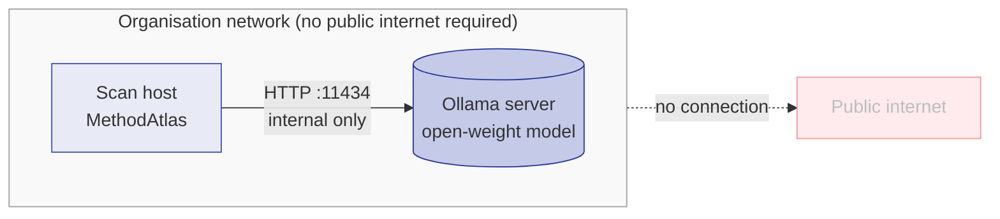
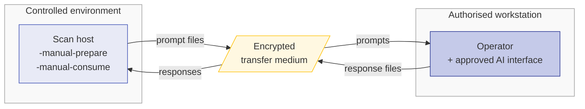

# Air-Gapped and Offline Deployment

Organisations operating under strict network egress controls — common in
financial services, defence, healthcare, and critical infrastructure — can
run MethodAtlas without any outbound connections from the scan host. This
page covers two independent approaches and the conditions under which each
is appropriate.

## Approach comparison

| Approach | Outbound connections from scan host | AI quality | Operator effort |
|---|---|---|---|
| **Local inference (Ollama)** | None — inference runs on the same network segment | Comparable to hosted models for supported sizes | Initial server setup; model distribution |
| **Manual AI workflow** | None in either phase | Depends on the AI interface used by the operator | Per-class copy-paste; suitable for small codebases or selective classification |

Both approaches produce output identical in format to an API-connected scan.

**Approach 1 — Local inference (Ollama)**



**Approach 2 — Manual AI workflow**



## Approach 1: local inference with Ollama

[Ollama](https://ollama.com) runs open-weight language models locally.
MethodAtlas connects to it over HTTP on the same host or internal network;
no connection to the public internet is made.

### Server installation

**Docker (recommended for CI environments):**

```bash
docker pull ollama/ollama
docker run -d \
  --name ollama \
  --restart unless-stopped \
  -p 11434:11434 \
  -v ollama-data:/root/.ollama \
  ollama/ollama
```

**Binary (recommended for developer workstations):**

Download the release binary for your platform from the
[Ollama releases page](https://github.com/ollama/ollama/releases) and
install it on the server. Then start the service:

```bash
ollama serve
```

### Model distribution

In a network-isolated environment the Ollama server cannot download models
from the internet. Distribute models using one of the following methods:

**Method A — pre-pull on an internet-connected host, export the model volume:**

```bash
# On an internet-connected host
docker run -d --name ollama-seed -v ollama-seed:/root/.ollama ollama/ollama
docker exec ollama-seed ollama pull qwen2.5-coder:7b

# Export the volume
docker run --rm -v ollama-seed:/data -v $(pwd):/backup \
  alpine tar czf /backup/ollama-models.tar.gz -C /data .

# Transfer ollama-models.tar.gz to the air-gapped host, then restore
docker run --rm -v ollama-data:/data -v $(pwd):/backup \
  alpine tar xzf /backup/ollama-models.tar.gz -C /data
```

**Method B — Ollama registry mirror:**

If your organisation operates an internal container or artefact registry
that proxies the Ollama model library, set the `OLLAMA_MODELS` environment
variable to point to it before starting the Ollama server.

### Recommended models for code classification

| Model | Size | Notes |
|---|---|---|
| `qwen2.5-coder:7b` | ~4 GB | MethodAtlas default; strong code understanding |
| `qwen2.5-coder:14b` | ~8 GB | Higher classification accuracy; requires more RAM |
| `llama3.1:8b` | ~5 GB | General-purpose; good alternative if Qwen is unavailable |

For GPU-accelerated inference, the Docker run command should include
`--gpus all` and the host must have the NVIDIA Container Toolkit installed.

### MethodAtlas configuration

```bash
java -jar methodatlas.jar \
  -ai -ai-provider ollama \
  -ai-base-url http://<ollama-host>:11434 \
  -ai-model qwen2.5-coder:7b \
  -content-hash \
  src/test/java
```

For a YAML configuration file committed to the repository:

```yaml
aiProvider: ollama
aiBaseUrl: http://ollama.internal:11434
aiModel: qwen2.5-coder:7b
contentHash: true
```

### Network policy requirements

If the scan host and the Ollama server are on separate network segments,
the following connectivity is required:

| Source | Destination | Port | Protocol |
|---|---|---|---|
| Scan host | Ollama server | 11434 | TCP (HTTP) |

No other outbound connectivity is required when using Ollama.

### CI pipeline integration

```yaml
# GitHub Actions example — Ollama running as a service container
jobs:
  scan:
    runs-on: ubuntu-latest
    services:
      ollama:
        image: ollama/ollama
        ports:
          - 11434:11434

    steps:
      - uses: actions/checkout@v4

      - uses: actions/setup-java@v4
        with:
          java-version: '21'
          distribution: 'temurin'

      - name: Pull model
        run: |
          curl -s http://localhost:11434/api/pull \
            -d '{"name":"qwen2.5-coder:7b"}'

      - name: Download MethodAtlas
        run: |
          curl -fsSL -o methodatlas.jar \
            https://github.com/Accenture/MethodAtlas/releases/latest/download/methodatlas.jar

      - name: Run MethodAtlas
        run: |
          java -jar methodatlas.jar \
            -ai -ai-provider ollama \
            -ai-base-url http://localhost:11434 \
            -ai-model qwen2.5-coder:7b \
            -sarif -security-only -content-hash \
            src/test/java > security-tests.sarif
```

## Approach 2: manual AI workflow

The manual workflow separates MethodAtlas into two phases that each require
zero network connectivity from the scan host. An operator carries prompt
files to an authorised workstation and pastes them into an approved AI
interface.

This approach is appropriate when:
- No internal server is available to run Ollama.
- The approved AI interface is a supervised, organisation-controlled
  deployment (e.g. Microsoft Azure OpenAI in a private endpoint configuration,
  or a behind-the-firewall LLM appliance).
- The codebase is small enough that per-class manual interaction is practical
  (typically fewer than fifty test classes).

### Phase 1 — Prepare (scan host, no network required)

```bash
java -jar methodatlas.jar \
  -manual-prepare ./work ./responses \
  src/test/java
```

MethodAtlas writes one work file per test class into `./work/`. Each work
file contains the full AI prompt: the taxonomy text, the list of method names
the parser found, and the class source. No network call is made.

### Operator phase — on an authorised workstation

For each file in `./work/`:

1. Open the file and locate the `AI PROMPT` section.
2. Paste the prompt into the approved AI interface.
3. Copy the response (the JSON object within the AI's reply).
4. Save it as the corresponding `.response.txt` file in `./responses/`.

The response file may contain surrounding prose; MethodAtlas extracts the
first JSON object it finds and ignores any additional text.

### Phase 2 — Consume (scan host, no network required)

```bash
java -jar methodatlas.jar \
  -manual-consume ./work ./responses \
  -content-hash \
  -sarif \
  src/test/java > security-tests.sarif
```

Classes whose response file is absent are emitted with empty AI columns;
the consume phase never fails due to missing responses.

### Combining with override file

For repeated scans of a stable codebase, the overhead of the manual
operator phase can be reduced by combining it with an [override file](../ai/overrides.md):

1. Run the manual workflow once to classify the full codebase.
2. Commit the SARIF or CSV output alongside an override file that captures
   all confirmed classifications.
3. On subsequent scans, run in static mode (`-override-file` without `-ai`).
   Only new or changed classes need to go through the manual workflow.

```bash
# Subsequent scan: static mode for known classes, manual for new ones
java -jar methodatlas.jar \
  -override-file ./overrides.yaml \
  -content-hash \
  src/test/java > security-tests.csv
```

## Artefact integrity in air-gapped environments

When MethodAtlas is installed from a downloaded JAR rather than from the
network at scan time, verify the JAR's integrity before use. The GitHub
release page for each version provides the expected SHA-256 digest.

```bash
# Verify the JAR before use
sha256sum methodatlas.jar
# Compare against the digest published on the GitHub release page
```

Store the verified JAR in an internal artefact repository (Artifactory,
Nexus, or equivalent) so that all scan hosts use the same verified binary.

## Further reading

- [Manual AI Workflow](../usage-modes/manual.md) — complete phase reference
- [AI Providers — Ollama](../ai/providers.md) — provider configuration details
- [DORA](dora.md) — DORA Article 25 air-gapped guidance
- [Data Governance](../concepts/data-governance.md) — what data MethodAtlas
  processes and when
