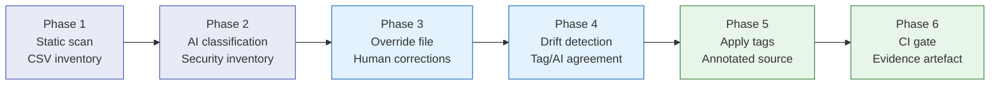

# Onboarding a Brownfield Codebase

This page describes the recommended sequence for introducing MethodAtlas to an
existing Java project — one that already has a test suite but no established
classification, override file, or CI integration.

The steps are designed to be progressive: each phase produces usable value on
its own, and the next phase builds on the previous one without requiring any
rework.



## Phase 1 — Static scan (day 1)

**Context:** Start with a no-AI scan to understand the size and structure of
the test suite. No AI provider, no configuration, no network access required.

**MethodAtlas capability:** structural discovery — method names, class FQCNs,
line counts, and any existing `@Tag` values.

```bash
./methodatlas src/test/java > inventory.csv
```

**Expected output:** `inventory.csv` — one row per test method with structural
columns (`fqcn`, `method`, `loc`, `tags`). AI columns are empty at this stage.

Review the output:

- How many test methods does the project have?
- Which classes have `@Tag` values already?
- Are any `@DisplayName` annotations already in place?

Keep `inventory.csv` under version control — it will be your starting point
for the delta report in Phase 4.

## Phase 2 — AI classification (first week)

**Context:** Classify the full test suite to identify which methods cover
security-relevant behaviour.

**MethodAtlas capability:** AI-powered semantic classification with
[`-content-hash`](../cli-reference.md#-content-hash) for cache-ready output.

```bash
./methodatlas -ai -content-hash \
  -ai-provider <provider> \
  -ai-api-key-env <ENV_VAR> \
  src/test/java > scan-v1.csv
```

**Expected output:** `scan-v1.csv` — the Phase 1 inventory enriched with
`ai_security_relevant`, `ai_tags`, `ai_reason`, `ai_confidence`, and
`content_hash` columns.

Review the `ai_security_relevant`, `ai_tags`, and `ai_reason` columns:

- Do the security-relevant classifications look correct?
- Are there obvious false positives (e.g. utility or formatter tests classified
  as security-relevant)?
- Are there known-security tests classified as not relevant?

At this stage, do not apply any annotations yet. The goal is to understand
classification quality before acting on it.

## Phase 3 — Override file and human corrections

**Context:** Lock in human-reviewed corrections so they survive model changes,
prompt updates, and re-runs.

**MethodAtlas capability:**
[`-override-file`](../cli-reference.md#-override-file) applies deterministic
corrections on top of AI output; results are version-controlled and auditable.

```yaml
# .methodatlas-overrides.yaml
overrides:
  - fqcn: com.acme.util.DateFormatterTest
    method: format_returnsIso8601
    securityRelevant: false
    reason: "Date formatting only — no security property tested"
    note: "Reviewed 2026-04-25 by alice"

  - fqcn: com.acme.crypto.AesGcmTest
    method: roundTrip_encryptDecrypt
    securityRelevant: true
    tags: [security, crypto]
    reason: "Validates AES-GCM correctness — core cryptographic test"
    note: "Confirmed 2026-04-25 by security team"
```

Re-run with the override file to verify that the corrections are applied:

```bash
./methodatlas -ai -content-hash -ai-cache scan-v1.csv \
  -override-file .methodatlas-overrides.yaml \
  src/test/java > scan-v2.csv
```

**Expected output:** `scan-v2.csv` — same as `scan-v1.csv` but with override
rows showing `override_applied: true` and the reviewer-supplied values in place
of AI output.

Commit the override file to version control. Every future PR that changes it
becomes an auditable record of a human classification decision.

See [Classification Overrides](../ai/overrides.md) for the full field reference
and review cadence guidance.

## Phase 4 — Drift detection gate

**Context:** Surface disagreements between `@Tag("security")` in source and AI
classifications before they accumulate.

**MethodAtlas capability:** `-drift-detect` emits a `tag_ai_drift` column
flagging every method where source annotations and AI verdict disagree.

```bash
./methodatlas -ai -content-hash -ai-cache scan-v2.csv \
  -override-file .methodatlas-overrides.yaml \
  -drift-detect \
  src/test/java > scan-v3.csv
```

**Expected output:** `scan-v3.csv` — enriched with a `tag_ai_drift` column.

Review the `tag_ai_drift` column:

- `ai-only` — AI considers it security-relevant but the source has no
  `@Tag("security")`; either add the tag or add an override.
- `tag-only` — the source has `@Tag("security")` but AI disagrees; either
  remove the tag or add an override confirming human intent.

Once the drift count reaches zero (or the remaining drift entries are
explained), the codebase is consistent. From this point, adding drift detection
to CI will catch future regressions.

## Phase 5 — Apply annotations (optional)

**Context:** Write AI-suggested `@DisplayName` and `@Tag` annotations back to
source so the intent is expressed in code, not only in the CSV.

**MethodAtlas capability:** `-apply-tags` and `-apply-tags-from-csv` write
annotations back to source; [`-mismatch-limit`](../cli-reference.md#-mismatch-limit)
guards against unexpected changes.

**Option A — Direct AI write-back:**

```bash
./methodatlas -ai -apply-tags src/test/java
```

Only security-relevant methods are annotated. Existing annotations are not
overwritten. Review the diff before committing.

**Option B — CSV-reviewed write-back:**

```bash
# 1. Produce the review CSV
./methodatlas -ai -content-hash -ai-cache scan-v3.csv \
  -override-file .methodatlas-overrides.yaml \
  src/test/java > review.csv

# 2. Open review.csv and adjust the display_name and tags columns.
#    Leave rows unchanged if no annotation change is wanted.

# 3. Apply with mismatch guard
./methodatlas -apply-tags-from-csv review.csv -mismatch-limit 1 src/test/java
```

**Expected output:** Modified test source files with `@DisplayName` and
`@Tag` annotations added or updated.

Option B is preferred in regulated environments because it requires explicit
human sign-off (editing the CSV) before any source file is touched.

See [Apply Tags from CSV](../usage-modes/apply-tags-from-csv.md) for the full
workflow.

## Phase 6 — CI gate

**Context:** Prevent future regressions by running MethodAtlas on every push
and producing a formal evidence artefact on every release.

**MethodAtlas capability:** full pipeline integration with caching, override
application, SARIF output, and metadata embedding.

```bash
./methodatlas \
  -ai -ai-provider <provider> -ai-api-key-env <ENV_VAR> \
  -content-hash -ai-cache scan-v3.csv \
  -override-file .methodatlas-overrides.yaml \
  -sarif \
  -security-only \
  -emit-metadata \
  src/test/java \
  > security-tests.sarif
```

**Expected output:** `security-tests.sarif` — a SARIF 2.1.0 file containing
only security-relevant methods, with content hashes and scan metadata embedded.
Suitable for GitHub Code Scanning, archiving as evidence, or submission to
assessors.

Commit `scan-v3.csv` (the cache) and `.methodatlas-overrides.yaml` to the
repository. The CI run will:

- Reuse AI results for unchanged classes (zero API calls for stable code)
- Re-classify any new or changed class
- Apply human overrides on top of AI output
- Emit a SARIF file suitable for GitHub Code Scanning or archiving as evidence

Add `-mismatch-limit 1` to the apply-tags-from-csv step in CI if annotation
write-back is part of the pipeline.

See per-platform CI guides: [GitHub Actions](../ci/github-actions.md),
[GitLab](../ci/gitlab.md), [Azure DevOps](../ci/azure-devops.md).

## Summary: progression at a glance

| Phase                   | Key flags added                               | Artefact / outcome |
|-------------------------|-----------------------------------------------|--------------------|
| 1 — Static scan         | *(no flags)*                                  | `inventory.csv` — baseline count; existing tag inventory |
| 2 — AI classification   | `-ai -content-hash`                           | `scan-v1.csv` — security inventory with rationale and confidence |
| 3 — Override file       | `-ai-cache … -override-file …`                | `scan-v2.csv` — human corrections; auditable decision log |
| 4 — Drift detection     | `-drift-detect`                               | `scan-v3.csv` — source `@Tag` / AI agreement established |
| 5 — Annotations         | `-apply-tags-from-csv`                        | Modified source — annotations match agreed state |
| 6 — CI gate             | `-sarif -security-only -emit-metadata`        | `security-tests.sarif` — regression detection; formal evidence artefact |
