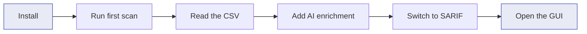

# Fast Track — for newcomers

A guided 30-minute path from a fresh checkout to a first useful scan
report. Every step links to the canonical reference page if you want to
dig deeper, but you can complete the track without reading anything else.

If you have never run MethodAtlas before, start here. If you are wiring
the tool into a pipeline, hardening a regulated deployment, or extending
the SPI, jump to the [Implementer Track](implementer-track.md) instead.

## What you will learn



By the end you will know how to scan a project, enable AI security
classification with a local Ollama or a cloud provider, produce a SARIF
file for GitHub Code Scanning, and use the desktop GUI to review and
stage tag changes.

## Step 1 — Install

| You have | What to do | Reference |
|---|---|---|
| A built `methodatlas-<version>.zip` | Unzip it, add `bin/` to your `PATH` | [Installation](installation.md) |
| Source checkout | `./gradlew installDist` then use `build/install/methodatlas/bin/` | [Installation](installation.md) |
| Just want to play in the GUI | `./gradlew :methodatlas-gui:run` | [Desktop GUI](gui.md) |

The distribution contains two start scripts — `methodatlas` (CLI) and
`methodatlas-gui` (Swing desktop application) — sharing one `lib/`
directory.

## Step 2 — Run your first scan

Point the CLI at a test source tree. No flags required.

```bash
./methodatlas src/test/java
```

The default output is CSV, one row per discovered test method:

```text
fqcn,method,loc,tags,display_name
com.acme.tests.LoginTest,rejectsExpiredToken,8,security;auth,
com.acme.tests.LoginTest,acceptsValidToken,6,security;auth,
```

MethodAtlas discovered the methods by lexically parsing the source — it
did **not** compile the project. This is why the scan is fast and works
even on broken codebases.

**Try it on each supported language**: replace `src/test/java` with
`src/test/csharp/`, `tests/`, a Go module path, or a directory of
`*.Tests.ps1` files. The discovery plugin selects itself by file
extension. The full per-language conventions are tabulated in the
[Discovery plugins quick reference](discovery-plugins.md#quick-reference).

## Step 3 — Add AI enrichment

The AST scan gives you method names and existing tags. AI enrichment adds
a security relevance label, a suggested taxonomy tag set, and a
human-readable rationale per method.

### Option A — local model (no API key, fully offline-capable)

Run [Ollama](https://ollama.com) on your machine, pull a small code model,
and add `-ai`:

```bash
ollama pull qwen2.5-coder:7b

./methodatlas -ai \
  -ai-provider ollama \
  -ai-model qwen2.5-coder:7b \
  src/test/java
```

### Option B — a cloud provider

Any of the supported cloud providers works the same way. Export the API
key, then point `-ai-provider` at it:

```bash
export OPENROUTER_API_KEY=sk-or-...
./methodatlas -ai \
  -ai-provider openrouter \
  -ai-model anthropic/claude-3.5-sonnet \
  -ai-api-key-env OPENROUTER_API_KEY \
  src/test/java
```

The full provider list — Ollama, OpenAI, Anthropic, Azure OpenAI,
Mistral, Groq, xAI, GitHub Models, OpenRouter, plus an `auto` mode that
picks a working one — is on the [AI providers](ai/providers.md) page.

!!! info "What gets sent to the AI"
    Only the **test source files** in the scan tree are submitted. Production
    code is never read or transmitted. The full data-handling contract is in
    [Data governance](concepts/data-governance.md) — read it before approving
    a cloud provider for company use.

## Step 4 — Switch the output format

The default CSV is human-readable. For tooling integration, pick one of:

| Flag | Output | When to use |
|---|---|---|
| *(none)* | CSV (default) | Spreadsheet review, ad-hoc grep |
| `-plain` | Plain text | Terminal-only debugging |
| `-sarif` | SARIF&nbsp;2.1.0 | Upload to GitHub Code Scanning or any SAST UI |
| `-json` | Flat JSON array | Custom dashboards, data warehouses |
| `-github-annotations` | `::notice` / `::warning` workflow commands | PR inline annotations on a GitHub Actions runner |

The full schema for every format is on the
[Output formats](output-formats.md) page.

Example — SARIF for GitHub Code Scanning:

```bash
./methodatlas -ai -ai-provider ollama -ai-model qwen2.5-coder:7b \
              -sarif src/test/java > results.sarif
```

## Step 5 — Review in the GUI

If you would rather see the AI's chip suggestions and stage tag changes
visually, launch the GUI:

```bash
./methodatlas-gui
# or, from source:
./gradlew :methodatlas-gui:run
```

The window has a results tree on the left, a syntax-highlighted source
editor top-right, and a tag editor bottom-right. The
[Desktop GUI](gui.md) page walks through the icons, staging workflow,
and the audit-trail files written to `.methodatlas/`.

## Where to go next

| If you want to… | Read |
|---|---|
| Understand the conceptual model — what MethodAtlas *is* | [What is MethodAtlas?](why-methodatlas.md), [vs SAST tools](concepts/vs-sast.md) |
| See every CLI flag | [CLI options](cli-reference.md) |
| Configure a YAML preset instead of long command lines | [CLI options — `-config`](cli-reference.md#-config-file) |
| Wire it into CI/CD or a regulated environment | [Implementer Track](implementer-track.md) |
| Read findings as a security engineer | [Reading MethodAtlas reports](concepts/for-security-teams.md) |
