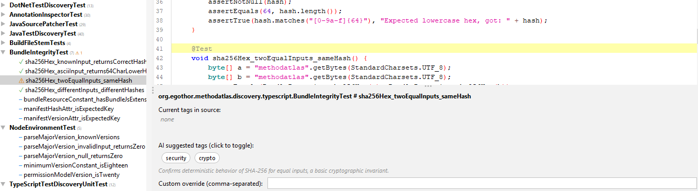

# Desktop GUI

The `methodatlas-gui` module is a professional Swing desktop application for interactive analysis and tag review. It targets security engineers and auditors who need to examine, override, and apply AI-suggested `@Tag` annotations without using the command line.

## Overview

[](img/gui-tag-editor.png)

The window is divided into three areas:

- **Left** — results tree, grouping discovered methods by class with colour-coded status icons
- **Top-right** — syntax-highlighted source editor (RSyntaxTextArea) with line numbers and code folding
- **Bottom-right** — tag editor with the current method's existing tags, AI-suggested tag chips, a custom override field, and staging buttons

## Results tree icons

| Icon | Colour | Meaning |
| --- | --- | --- |
| `⚠` | Orange | AI suggests tags not yet present in source — needs review |
| `✓` | Green | Source tags satisfy the AI suggestion — nothing to do |
| `–` | Blue | AI classified this method as not security-relevant |
| `○` | Grey | No AI data yet |
| `✎` | Orange | Changes staged but not yet written to disk |

## Tag editor buttons

Three buttons appear in the bottom-right of the tag editor panel.  Understanding the difference between them is important:

| Button | What it does |
| --- | --- |
| **Stage Selection** | Stages exactly the tags that are currently toggled on in the AI chip row, plus any text entered in the custom override field.  Use this when you want to cherry-pick from the AI suggestions or add your own tags. |
| **Accept All AI Tags** | Stages every tag the AI suggested for this method, regardless of which chips are toggled.  Use this for a one-click accept when you agree with the full AI recommendation. |
| **Unstage** | Discards any staged (pending) changes for the current method without touching the source file. |

!!! note "Nothing is written to disk until Save All Changes"
    Both staging buttons only mark the method as pending — no file I/O happens.  The toolbar **Save All Changes** button batches all staged patches per file into a single write, which prevents line-number drift when multiple methods in the same class are modified.

## Staged workflow

1. Run analysis (▶ Run Analysis) — the tree populates incrementally; the first method needing review is auto-selected when AI finishes.
2. For each `⚠` method: review the AI chip suggestions, toggle individual chips on/off, optionally add custom tags, then click **Stage Selection** or **Accept All AI Tags**.
3. The method icon changes to `✎` and the tag row in the tree shows the pending tags.
4. When all desired methods are staged, press **Save All Changes** in the toolbar.  All staged methods are patched in one pass per file and the editor reloads with the updated content.

## Audit trail

Every **Save All Changes** writes two artefacts into `.methodatlas/` inside the scanned directory:

- **`methodatlas-YYYYMMDD-HHmmss.csv`** — immutable timestamped record of every patched method: AI suggestion, user decision, drift category.  Compatible with the CLI `DeltaReport` schema.
- **`overrides.yaml`** — cumulative `ClassificationOverride` YAML; pass it to a future CLI run via `--override .methodatlas/overrides.yaml` to reproduce the same decisions without re-invoking the AI.

The `note` field in each YAML entry carries `"Reviewed <ISO-8601> by <operator>"` when an operator name is configured in **Settings → Audit**.

## Settings

Open **⚙ Settings** to configure:

- **AI Profiles** — named provider configurations; switch the active profile from the toolbar combo box without opening Settings
- **Discovery Plugins** — enable or disable individual language plugins per scan
- **Audit** — operator name written into audit records
- **Appearance** — theme (IntelliJ Light / Flat Dark / Flat Light / Darcula); takes effect on next launch

## Build and run

```bash
# Build the GUI distribution
./gradlew :methodatlas-gui:build

# Run directly from Gradle
./gradlew :methodatlas-gui:run

# Run the generated start script (Unix)
methodatlas-gui/build/install/methodatlas-gui/bin/methodatlas-gui

# Run the generated start script (Windows)
methodatlas-gui\build\install\methodatlas-gui\bin\methodatlas-gui.bat
```

Settings are persisted to `%APPDATA%\MethodAtlasGUI\settings.json` on Windows and
`$XDG_CONFIG_HOME/methodatlas-gui/settings.json` (or `~/.methodatlas-gui/settings.json`) on Linux and macOS.
