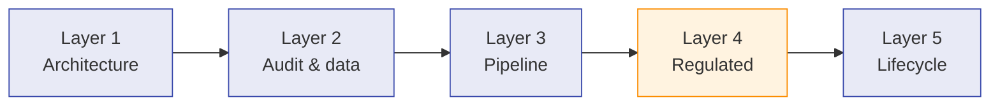

# Implementer Track — for CI/CD and regulated environments

A reading path for engineers who own a pipeline, a compliance posture, or
a tool-onboarding process. It assumes you can already run a basic scan;
if not, complete the [Fast Track](fast-track.md) first.

The track is organised in five layers. Each layer is a self-contained
reading checkpoint — finish a layer before moving on to the next.

Working through the layers sequentially takes most teams between half a
day and two days, depending on how much of the underlying infrastructure
(CI runners, secret store, artefact retention, compliance evidence
pipeline) already exists. The earlier layers consist mostly of decisions
and reading; the later layers consist mostly of configuration changes in
your existing pipeline. None of the layers requires modifying
MethodAtlas itself — every customisation is expressed through CLI flags,
a YAML config file, an override file, or an environment variable.

## How the layers fit together

The five layers form a linear progression: each layer answers a
different stakeholder's question, and the answers tend to be needed in
this order during a real integration.

| Layer | Who asks the question | What gets answered |
|---|---|---|
| 1 — Architecture | Platform / SRE | What software are we deploying, and what does it need on the host? |
| 2 — Audit & data | Security, Legal | What data leaves the perimeter; what evidence is retained? |
| 3 — Pipeline | DevOps | Where does it run, on what trigger, and what gates the build? |
| 4 — Regulated | Compliance | Which controls in PCI/ISO/SSDF/DORA/SOC&nbsp;2 does it contribute evidence for? |
| 5 — Lifecycle | Engineering ownership | How do we upgrade, extend, and detect drift? |

Layers 1–3 are usually owned by a platform or DevOps team and complete
in a single sprint; layer 4 typically requires a separate compliance
review cycle; layer 5 is a continuing operational concern rather than a
one-off integration step.

## Layer 1 — Architecture

Before you decide how to deploy MethodAtlas, learn how it is constructed.
This affects every subsequent integration decision — from JAR placement
to plugin policy to where AI traffic egresses.

| Read | Why it matters |
|---|---|
| [Architecture](architecture.md) | Multi-module Gradle layout, SPI boundaries, ServiceLoader-driven plugin loading |
| [Parser internals](parser-internals.md) | Lexical-only parsing — no compilation, no class loading from scanned code |
| [Quality gates](quality-gates.md) | Per-module floors enforced on every push; thresholds you can reproduce in your own pipeline |

**Decisions you should reach by the end of Layer 1:** which discovery
plugins your fleet needs, whether the GUI ships to laptops, and whether
your CI runners need Node.js (only the TypeScript plugin requires it).

## Layer 2 — Audit & data governance

Auditors will ask three questions: what data is read, where it goes, and
what is retained. MethodAtlas has explicit, documented answers — not
defaults that vary with the model.

| Read | What it answers |
|---|---|
| [Audit trail](audit-trail.md) | Schema and retention of `.methodatlas/*.csv` and `overrides.yaml` |
| [Data governance](concepts/data-governance.md) | Exact bytes transmitted to each AI provider; pinned-class taxonomy contract |
| [Classification overrides](ai/overrides.md) | YAML schema (the contract downstream tooling depends on) |
| [Remote overrides](ai/remote-overrides.md) | Centrally-managed override URLs for fleet-wide policy |
| [Tag vs AI drift](ai/drift-detection.md) | The drift signal that lets you detect classification regressions |

!!! warning "Schema stability is a contract"
    `DeltaReport` CSV columns and `ClassificationOverride` YAML fields are
    consumed by downstream compliance tooling. Renaming or reordering them
    is a breaking change and requires a schema-version bump. See the
    [Migration guide](migration.md) for the current schema version.

## Layer 3 — Pipeline integration

MethodAtlas was built for CI. This layer covers the three concerns you
will face on every pipeline you wire it into: platform mechanics, gating
policy, and multi-module sprawl.

### Platform recipes

| Platform | Recipe | Notes |
|---|---|---|
| GitHub Actions | [GitHub Actions](ci/github-actions.md) | Includes the reusable `methodatlas-analysis.yml` workflow |
| GitLab CI | [GitLab CI](ci/gitlab.md) | Pipeline templates and artefact retention |
| Azure DevOps | [Azure DevOps Pipelines](ci/azure-devops.md) | YAML pipeline samples |

If your platform is not in the list, [Platform prerequisites](ci-setup.md)
documents the host requirements (JDK 21+, optional Node.js for the TS
plugin) so you can port the recipe yourself.

### Gating and release policy

| Read | Why |
|---|---|
| [Release gating](ci/release-gating.md) | How to fail a PR or block a release on AI-classified findings |
| [Multi-module projects](ci/monorepo.md) | Scan-once-per-module patterns, cache reuse |
| [Reports](reports.md) | Every report artefact the build publishes, with retention and licence-allowlist gate |
| [CLI options](cli-reference.md) | Operator flags: `-content-hash`, `-emit-metadata`, `-mismatch-limit`, `-min-confidence`, `-sarif-omit-scores` |

### Output schemas — pick what your tooling consumes

| Format | When | Schema page |
|---|---|---|
| SARIF&nbsp;2.1.0 | GitHub Code Scanning, any SARIF-aware SAST UI | [Output formats § SARIF](output-formats.md#sarif-mode) |
| JSON array | Custom dashboards, BI ingestion | [Output formats § JSON](output-formats.md#json-mode) |
| CSV with `content_hash` | Idempotent re-runs, change detection | [Output formats § CSV](output-formats.md#csv-mode) |
| Delta CSV | Diff two runs (CI gate input) | [Delta report](usage-modes/delta.md) |
| GitHub Annotations | PR inline notices | [Output formats § GitHub Annotations](output-formats.md#github-actions-annotations-mode) |

## Layer 4 — Regulated environments

If your deployment touches PCI cardholder data, EU financial-entity ICT
risk, or a 27001-certified scope, this layer is the substantive part.
Each compliance doc walks through the specific clauses or requirements
MethodAtlas helps satisfy — none of them claim a tool *makes* you
compliant; they show you exactly where the tool contributes to the
auditor's evidence pack.

| Framework | Page | Substantive citations |
|---|---|---|
| Air-gap deployment | [Air-gapped](deployment/air-gapped.md) | Manual prepare/consume mode, local Ollama, override-only AI |
| Onboarding a brownfield codebase | [Onboarding](deployment/onboarding.md) | Phased rollout, initial classification policy |
| PCI&nbsp;DSS v4.0 | [PCI-DSS](deployment/pci-dss.md) | Requirement&nbsp;6 mapping; QSA caveat |
| ISO/IEC&nbsp;27001:2022 | [ISO 27001](deployment/iso-27001.md) | Annex&nbsp;A controls; certification caveat |
| NIST SP 800-218 (SSDF) | [SSDF](deployment/nist-ssdf.md) | OMB&nbsp;M-22-18 attestation context |
| EU DORA | [DORA](deployment/dora.md) | Regulation (EU) 2022/2554; applicability 17 Jan 2025 |
| SOC&nbsp;2 | [SOC 2](deployment/soc2.md) | AICPA Trust Services Criteria; Type II observation window |
| OWASP ASVS | [ASVS mapping](concepts/asvs-mapping.md) | Per-tag to ASVS chapter requirement-ID table |

The cross-cutting baseline that all of the above reference is on the
[Regulated environments overview](deployment/index.md) page —
recommended scan configuration, retention defaults, AI provider posture.

## Layer 5 — Lifecycle and extension

Once the tool is integrated, you will face three recurring questions:
how do upgrades go, how do you add support for a language we have not
shipped, and what do you do when AI suggestions drift from source tags?

| Read | When you need it |
|---|---|
| [Migration guide](migration.md) | Upgrading a major version; schema-version bumps |
| [Discovery plugins](discovery-plugins.md) | The full per-language reference, including how to add your own via the SPI |
| [Custom taxonomy](ai/custom-taxonomy.md) | Pinning your own closed security-tag vocabulary |
| [Tag vs AI drift](ai/drift-detection.md) | Operationalising drift as a CI signal |
| [Troubleshooting](troubleshooting.md) | The known-issue catalogue and recovery procedures |

## Acceptance checklist

Use this checklist when you sign off your MethodAtlas integration.

- [ ] CI runner has JDK 21+ and (if scanning TypeScript) Node.js 18+
- [ ] Output format chosen and consumer wired (SARIF / JSON / Delta CSV)
- [ ] AI provider approved per [Data governance](concepts/data-governance.md); credentials in a secret store, not the YAML
- [ ] Override file location decided; remote-override URL if applicable
- [ ] Retention policy on `.methodatlas/*.csv` matches the compliance framework
- [ ] Drift detection enabled and routed to a Security alert channel
- [ ] PIT mutation / JaCoCo coverage thresholds mirrored in your own quality gates if MethodAtlas is part of a regulated build
- [ ] Release pipeline pins the MethodAtlas version (no `latest` tags)
- [ ] Documentation PDF (`./gradlew :methodatlas-docs:generatePdf`) archived alongside the binary for the relevant audit window
