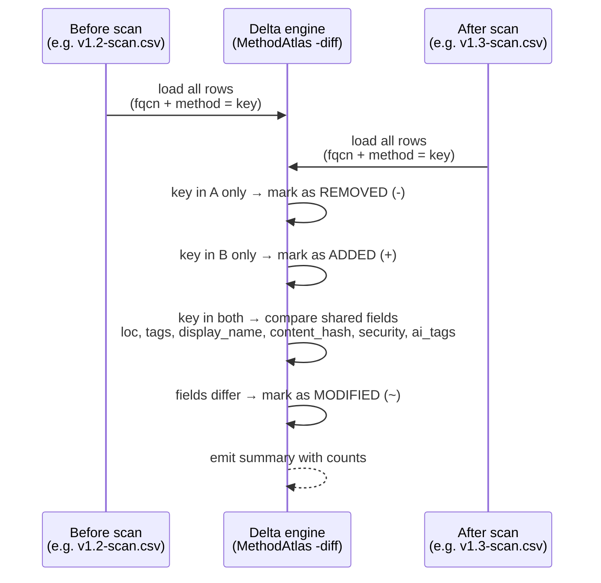

# Delta Report

The `-diff` flag compares two MethodAtlas scan outputs (CSV files) and reports which test methods were added, removed, or modified between the two runs. It is the primary mechanism for change-tracking, audit evidence, and CI gating on security-test coverage.

## When to use this mode

- You want to prove to an auditor that security-test coverage did not regress between two releases.
- You want to gate a CI pipeline on whether any security-relevant test was removed or reclassified.
- You want a change log of which security tests were added during a sprint or on a pull request.
- You want to detect source edits to existing security tests (requires both scans to use [`-content-hash`](../cli-reference.md#-content-hash)).

## How the comparison works



The two CSV files are compared using the `(fqcn, method)` pair as the key. Fields that are present in both files are compared; fields absent from either file (because the two scans used different flag sets) are skipped silently.

## Basic usage

```bash
./methodatlas -diff scan-before.csv scan-after.csv
```

Both files must be CSV outputs produced by MethodAtlas. All other flags are
ignored when `-diff` is present.

## Example output

```
MethodAtlas delta report
  before: scan-2026-04-10.csv  (scanned: 2026-04-10T09:00:00Z · 45 methods · 5 security-relevant)
  after:  scan-2026-04-24.csv  (scanned: 2026-04-24T14:30:00Z · 47 methods · 7 security-relevant)

+ com.acme.auth.Oauth2FlowTest  test_authCode
+ com.acme.auth.Oauth2FlowTest  test_tokenRefresh
- com.acme.auth.LegacyAuthTest  test_basicAuth
~ com.acme.crypto.AesGcmTest    roundTrip_encryptDecrypt  [source; security: false → true]

2 added  ·  1 removed  ·  1 modified  ·  42 unchanged
security-relevant: 5 → 7  (+2)
```

## Change-type indicators

| Symbol | Meaning |
|---|---|
| `+` | Method is new in the *after* scan — added since the *before* run |
| `-` | Method is absent from the *after* scan — removed or renamed since the *before* run |
| `~` | Method is present in both scans but one or more fields changed |

## What fields are compared

For each method present in both scans:

| Field | Compared when |
|---|---|
| `loc` | Always (lines of code in the method declaration) |
| `tags` | Always (JUnit `@Tag` annotations; order-independent) |
| `display_name` | Both files contain the `display_name` column; detects `@DisplayName` annotations added, removed, or renamed |
| `source` | Both files were produced with `-content-hash`; a difference means the enclosing class source was edited |
| `security` | Both files were produced with `-ai`; a flip of `ai_security_relevant` |
| `ai_tags` | Both files were produced with `-ai`; the AI taxonomy tag set changed |

Fields absent from either file (produced with different flag sets) are silently
skipped. You can compare a scan with `-content-hash` against one without it — only
the fields common to both files are compared.

## Change detail notation

A `~` (modified) line means the method is present in both the before and after scan, but at least one field changed. The bracketed summary after the method name lists every field that changed and, where possible, the old and new values.

Reading the example from above:

```
~ com.acme.crypto.AesGcmTest    roundTrip_encryptDecrypt  [source; security: false → true]
```

This means: the `content_hash` changed (the source was edited — indicated by `source`) and the AI security classification changed from `false` to `true`. Both changes happened in the same method between the two scans.

The full set of possible bracket tokens:

| Token | Meaning |
|---|---|
| `source` | `content_hash` differs — the class source was edited since the before scan |
| `loc: 5 → 8` | Lines of code in the method declaration changed (5 in before, 8 in after) |
| `tags` | The JUnit `@Tag` set changed (tags were added, removed, or renamed) |
| `display_name` | The `@DisplayName` annotation was added, removed, or its text changed |
| `security: false → true` | AI classification flipped from not-security-relevant to security-relevant |
| `security: true → false` | AI classification flipped from security-relevant to not-security-relevant (regression) |
| `ai_tags` | The AI taxonomy tag set changed (e.g. `auth` was added or removed) |

Multiple tokens are separated by semicolons. A method may appear with several changed fields at once.

## Why the delta report matters in the SDLC

### Sprint close / PR review

Run MethodAtlas at the start and end of a sprint (or on the base branch and the
feature branch), then diff the two outputs to answer *"did this sprint / this PR
add, remove, or reclassify security-relevant tests?"*:

```bash
git stash
./methodatlas -ai -content-hash -emit-metadata src/test/java > before.csv
git stash pop
./methodatlas -ai -content-hash -emit-metadata src/test/java > after.csv
./methodatlas -diff before.csv after.csv
```

### Regulatory evidence

Many security standards (PCI DSS, ISO 27001, SOC 2) require evidence that
security controls are tested and that the test coverage does not regress between
releases. A delta report generated at each release boundary provides a
machine-readable change log of the security-test layer:

- `+` lines prove new security tests were added alongside new features
- `-` lines must be reviewed and justified (was the test replaced or deleted?)
- `~` lines with `security: true → false` require particular scrutiny — a
  test that was previously considered security-relevant was reclassified

Store the delta output alongside the scan CSV in your artifact repository or
compliance folder.

### CI gating — detecting regressions

A simple shell gate that fails the build if any security-relevant test is removed
or reclassified away from security:

```bash
./methodatlas -diff before.csv after.csv > delta.txt
cat delta.txt

# Fail if any security-relevant test was removed
if grep -qE "^- " delta.txt; then
  echo "ERROR: test methods were removed — review delta.txt"
  exit 1
fi

# Fail if a security-relevant method was reclassified to non-security
if grep -qE "security: true → false" delta.txt; then
  echo "ERROR: security classification regressed — review delta.txt"
  exit 1
fi
```

### Nightly scan with archiving

A typical CI setup stores one scan output per day and computes the delta on each
run:

```yaml
# .github/workflows/security-delta.yml (excerpt)
- name: Run today's scan
  run: |
    ./methodatlas -ai -content-hash -emit-metadata \
      -ai-api-key-env ANTHROPIC_API_KEY \
      src/test/java > scans/$(date +%F).csv

- name: Compute delta from yesterday
  run: |
    YESTERDAY=$(date -d "yesterday" +%F)
    if [ -f "scans/$YESTERDAY.csv" ]; then
      ./methodatlas -diff "scans/$YESTERDAY.csv" scans/$(date +%F).csv \
        | tee delta-$(date +%F).txt
    else
      echo "No previous scan found; skipping delta"
    fi

- name: Archive scan and delta
  uses: actions/upload-artifact@v4
  with:
    name: security-scan-$(date +%F)
    path: |
      scans/$(date +%F).csv
      delta-$(date +%F).txt
```

## Combining with scan options

The `-diff` mode only consumes CSV files — it does not run a scan itself. To
produce the input files you can use any combination of scan options. For the most
informative delta, include both `-content-hash` (detects source edits) and `-ai`
(detects classification changes) in both scan runs:

```bash
# First scan (e.g. at release tag v1.2)
./methodatlas -ai -content-hash -emit-metadata \
  -ai-provider anthropic \
  -ai-api-key-env ANTHROPIC_API_KEY \
  src/test/java > v1.2-scan.csv

# Second scan (e.g. at release tag v1.3)
./methodatlas -ai -content-hash -emit-metadata \
  -ai-provider anthropic \
  -ai-api-key-env ANTHROPIC_API_KEY \
  src/test/java > v1.3-scan.csv

# Delta report
./methodatlas -diff v1.2-scan.csv v1.3-scan.csv
```

If you omit `-content-hash`, source changes cannot be detected; if you omit
`-ai`, only structural changes (method added, removed, LOC changed) will appear
in the delta.

## Limitations

- **Rename tracking** — when a class or method is renamed, it appears as one
  `REMOVED` entry and one `ADDED` entry. MethodAtlas does not attempt to infer
  renames from content-hash similarity.
- **Plain / SARIF inputs** — only CSV files produced by MethodAtlas are accepted.
  Plain-text and SARIF outputs cannot be diffed.
- **Exit code** — the command always exits with code `0`. Use shell post-processing
  (see the CI gating example above) to gate on specific change types.

See [CLI reference — `-diff`](../cli-reference.md#-diff) for the flag description.
