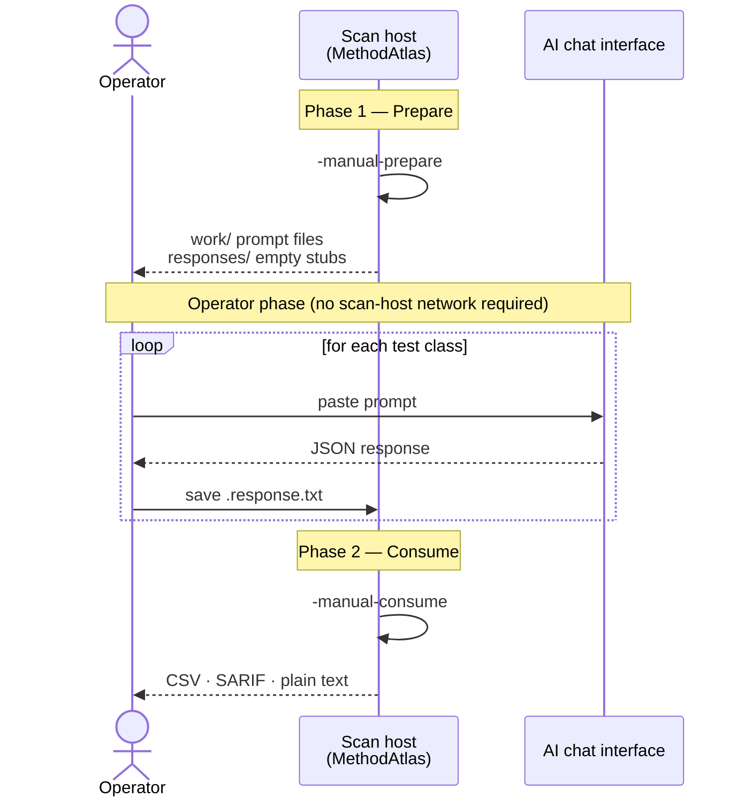

# Manual AI Workflow

A two-phase workflow for environments where direct API access is not possible:
air-gapped networks, regulated environments with strict egress controls, or teams
that must route AI interactions through a supervised chat interface.

The workflow produces the same CSV output as [API AI enrichment](api-ai.md).
The only difference is that the AI interaction is performed manually by an operator
between the two phases.



## Phase 1 — Prepare

Generate prompt files for every test class in the scan roots.

```bash
./methodatlas -manual-prepare ./work ./responses src/test/java
```

For each discovered test class MethodAtlas writes:

- A **work file** in `./work/` containing the full AI prompt (taxonomy +
  method list + class source).
- An **empty response placeholder** in `./responses/` that the operator will
  fill in after interacting with the AI.

No CSV is produced during Phase 1.

## Between phases — operator steps

For each work file in `./work/`:

1. Open the file and locate the `AI PROMPT` block.
2. Paste the prompt into your AI chat interface.
3. Copy the AI's JSON response.
4. Save it into the corresponding `.response.txt` file in `./responses/`.

The response file may contain free-form prose around the JSON (for example if
you copied the entire chat reply verbatim). MethodAtlas extracts the first JSON
object it finds and ignores any surrounding text.

## Phase 2 — Consume

Read the filled response files and emit the enriched CSV.

```bash
./methodatlas -manual-consume ./work ./responses src/test/java
```

Classes whose response file is absent or empty are emitted with blank AI columns;
the scan does not fail.

!!! tip "Work and response directories"
    The two directory arguments may point to the same path when a single
    working directory is sufficient.

## Combining with source write-back

After Phase 2, add `-apply-tags` to insert AI-generated annotations directly
into the source files instead of writing a CSV:

```bash
./methodatlas -manual-consume ./work ./responses \
  -apply-tags src/test/java
```

See [Source Write-back](apply-tags.md) for details and caveats.
