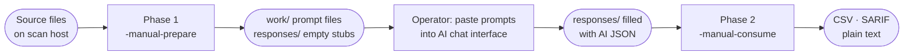
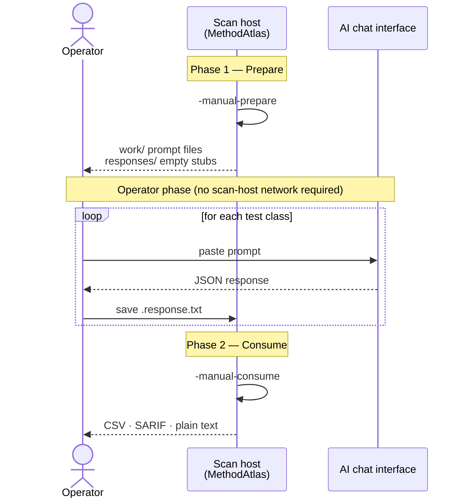

# Manual AI Workflow

The manual AI workflow produces the same enriched CSV output as [API AI enrichment](api-ai.md) without requiring any outbound network connection from the scan host. An operator carries prompt files to an internet-connected workstation, interacts with an AI chat interface there, and returns the responses for processing.

## When to use this mode

- The scan host has no outbound internet access (air-gapped network, strict DLP policy).
- Your organisation requires a human to review and approve what is submitted to an AI provider before transmission.
- You want to use a specific AI chat interface (ChatGPT, Claude.ai, an internal portal) that does not expose a programmable API.
- You are evaluating different AI providers and want to compare their responses without committing to API credentials.

If the scan host has direct API access, [API AI enrichment](api-ai.md) is simpler. The output is identical.

## Overview of the workflow



The scan host performs Phase 1 and Phase 2. The operator carries the `work/` directory to any machine with AI access between the two phases — no network connection is ever required from the scan host.



## Phase 1 — Prepare

Generate prompt files for every test class in the scan roots.

```bash
./methodatlas -manual-prepare ./work ./responses src/test/java
```

For each discovered test class MethodAtlas writes:

- A **work file** in `./work/` containing the full AI prompt (taxonomy + method list + class source).
- An **empty response placeholder** in `./responses/` that the operator will fill in after interacting with the AI.

No CSV is produced during Phase 1.

### Directory structure after Phase 1

After running `-manual-prepare` on a project with two test classes, the directories look like this:

```text
work/
  com.example.AuthServiceTest.prompt.txt
  com.example.PaymentTest.prompt.txt

responses/
  com.example.AuthServiceTest.response.txt   ← empty, waiting to be filled
  com.example.PaymentTest.response.txt       ← empty, waiting to be filled
```

Each work file contains three sections:

```text
=== CLASS: com.example.AuthServiceTest ===

=== METHODS ===
loginWithValidCredentials (line 12)
loginWithExpiredToken (line 24)
chargeWithExpiredCard (line 36)

=== AI PROMPT ===
<full prompt text — paste this into your AI chat interface>
```

The operator only needs the content of the `AI PROMPT` section. The rest of the work file is for reference.

## Between phases — operator steps

For each work file in `./work/`:

1. Open the file and locate the `AI PROMPT` block.
2. Paste the prompt into your AI chat interface.
3. Copy the AI's JSON response.
4. Save it into the corresponding `.response.txt` file in `./responses/`.

The response file may contain free-form prose around the JSON (for example if
you copied the entire chat reply verbatim). MethodAtlas extracts the first JSON
object it finds and ignores any surrounding text.

### What a filled response file looks like

After pasting the prompt and saving the AI's reply, `com.example.AuthServiceTest.response.txt` might contain:

```text
Sure! Here is the classification for the test class you provided:

{"methods":[{"method":"loginWithValidCredentials","securityRelevant":false,"tags":[],"displayName":"","reason":"Tests the happy-path login flow with no security assertion.","interactionScore":0.2},{"method":"loginWithExpiredToken","securityRelevant":true,"tags":["security","auth"],"displayName":"SECURITY: auth — login is rejected when the token has expired","reason":"Asserts AuthenticationException is thrown; verifies the token expiry path.","interactionScore":0.0}]}

Let me know if you need any adjustments.
```

The surrounding prose is ignored. The JSON object is extracted automatically.

### Directory structure after the operator phase

```text
work/
  com.example.AuthServiceTest.prompt.txt
  com.example.PaymentTest.prompt.txt

responses/
  com.example.AuthServiceTest.response.txt   ← filled with AI response
  com.example.PaymentTest.response.txt       ← filled with AI response
```

## Phase 2 — Consume

Read the filled response files and emit the enriched CSV.

```bash
./methodatlas -manual-consume ./work ./responses src/test/java
```

Classes whose response file is absent or empty are emitted with blank AI columns;
the scan does not fail.

### What the consume phase produces

The output is identical in format to [API AI enrichment](api-ai.md) output — the same CSV columns are present. For example:

```text
fqcn,method,loc,tags,display_name,ai_security_relevant,ai_display_name,ai_tags,ai_reason,ai_interaction_score
com.example.AuthServiceTest,loginWithValidCredentials,12,,,false,,,Tests the happy-path login flow with no security assertion.,0.2
com.example.AuthServiceTest,loginWithExpiredToken,8,security,,true,SECURITY: auth — login is rejected when the token has expired,security;auth,Asserts AuthenticationException is thrown; verifies the token expiry path.,0.0
```

This output can be consumed by all downstream steps that accept API AI enrichment output: [source write-back](apply-tags.md), [delta report](delta.md), and [security-only filter](security-only.md).

!!! tip "Work and response directories"
    The two directory arguments may point to the same path when a single
    working directory is sufficient.

## Combining with source write-back

After Phase 2, add `-apply-tags` to insert AI-generated annotations directly
into the source files instead of writing a CSV:

```bash
./methodatlas -manual-consume ./work ./responses \
  -apply-tags src/test/java
```

See [Source Write-back](apply-tags.md) for details and caveats.
