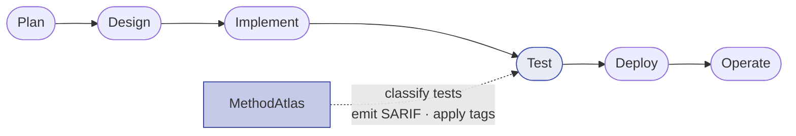
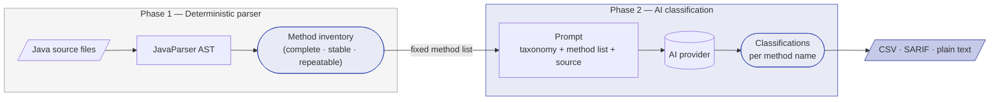

# What is MethodAtlas

## The problem

Modern Java projects routinely contain hundreds or thousands of JUnit test methods.
A fraction of those tests explicitly verify security properties — correct
authentication behaviour, cryptographic correctness, input validation, access
control boundaries — but they live side-by-side with purely functional tests and
are indistinguishable to anyone reading the test directory listing.

Without tooling, answering the question *"which of our tests cover security
requirements, and do they cover them completely?"* requires a manual audit of
every test file. That audit is time-consuming, error-prone, and does not stay
current as the codebase evolves.

MethodAtlas automates the discovery and classification step: it reads source
files lexically (without compiling them), identifies every test method
(JUnit 5, JUnit 4, and TestNG are detected automatically from import declarations),
and asks an AI provider to decide whether each method is security-relevant,
assign taxonomy tags, and provide a human-readable rationale.

## Where it fits in the SSDLC

MethodAtlas is a **testing-phase instrument** in the Secure Software Development
Life Cycle. It is not a replacement for static analysis, penetration testing, or
threat modelling — it complements those activities by maintaining a continuously
updated, machine-readable inventory of the security-test layer of a project.

Typical integration points:

| Activity | MethodAtlas role |
|----------|-----------------|
| Nightly CI scan | Emit SARIF to GitHub Code Scanning; flag new unclassified tests |
| Sprint close (automated) | Run `-apply-tags` to write AI-generated `@Tag` and `@DisplayName` annotations directly to source |
| Sprint close (reviewed) | Export CSV, review and adjust `tags`/`display_name` columns, replay decisions with `-apply-tags-from-csv` |
| Security review | Export CSV as evidence of security-test coverage for auditors |
| Air-gapped audit | Manual AI workflow produces the same CSV without network access |
| Regression gating | Content hashes detect classes that changed since the last approved scan |

## Why AI-assisted classification?

Manual classification of hundreds of tests is feasible once; keeping it current
across active development is not. AI-assisted classification offers:

- **Speed** — an entire test class is classified in seconds.
- **Consistency** — the same taxonomy is applied uniformly regardless of who
  wrote the test or how it is named.
- **Rationale** — the `ai_reason` field documents *why* a method was classified
  as security-relevant, making the classification defensible during review.
- **Automation** — the tool runs in CI with no human intervention when an API
  provider is available, or via the [manual workflow](usage-modes/manual.md) in
  restricted environments.

The taxonomy applied by MethodAtlas covers categories that align with the
OWASP Testing Guide and common CWE groupings: authentication, authorisation,
cryptography, input validation, session management, and others.

## The two-phase design

MethodAtlas does not simply forward source files to an AI and ask "which tests are security-relevant?". Instead it separates the work into two distinct phases: a deterministic parsing step that establishes the structural ground truth, followed by an AI classification step that adds semantic meaning.

### Phase 1 — deterministic method discovery

The parser reads each Java source file lexically, without compiling it, and extracts a precise list of test methods. The test framework is detected automatically from the file's import declarations — JUnit 5 Jupiter, JUnit 4 (including `@Theory`), and TestNG are all supported. This step is entirely rule-based: it finds every method carrying a recognised test annotation, or any custom annotation configured via `-test-marker`. The result is a canonical, repeatable inventory that does not depend on which AI model is used, which version is current, or whether the AI service is available at all.

This matters because AI models are not reliable at structural enumeration. Given a raw source file, a model may:

- silently skip a method that is hard to classify
- merge two methods into a single response entry
- hallucinate a method name that does not exist
- produce a different count on repeated invocations of the same prompt

None of these failure modes are possible when the method list is established by the parser first.

### Phase 2 — AI classification against a fixed list

The prompt sent to the AI provider contains the taxonomy, the class source, and — critically — the exact list of method names the parser found. The model is instructed to classify *only* those methods and to return one entry per name. It cannot add entries or omit them without the mismatch being detectable.

This constraint produces several practical benefits:

| Property | Effect |
|---|---|
| **Structural determinism** | The same set of methods is always discovered regardless of model choice or prompt variation |
| **Cost efficiency** | The model does not spend tokens searching for test methods — that work is already done |
| **Graceful degradation** | If AI classification fails for a class, the structural data (method names, line counts) is still emitted with blank AI columns; the scan is never aborted |
| **Auditability** | The method inventory can be verified independently of the AI output, which is important when the CSV is used as audit evidence |
| **Taxonomy control** | The permitted tag set is injected explicitly into every prompt, so the model cannot invent categories outside the defined taxonomy |

### Why not just use AI for everything?

Sending raw source trees to an AI and asking for a security-test inventory is superficially simpler but produces output that is difficult to trust in regulated contexts. There is no structural guarantee that every method was considered, no way to verify completeness without re-running the scan, and no stable output format if the model changes. MethodAtlas treats AI as a semantic enrichment layer on top of a foundation that is already correct by construction.

## Regulatory context

Multiple standards and frameworks require evidence of security testing as part
of the software development and assurance process. See the
[Compliance & Standards](compliance.md) page for a framework-by-framework
overview of how MethodAtlas supports those requirements.
